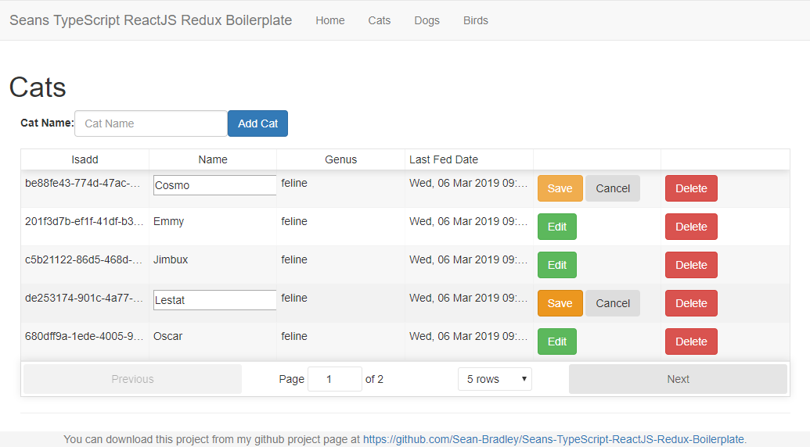

# Seans Typescript ReactJS Redux Boilerplate

## Live Demo

https://sean-bradley.github.io/Seans-TypeScript-ReactJS-Redux-Boilerplate/

### Video tutorial on setting up React/Redux app in GitHub pages
[](https://youtu.be/2z-_JxrLq0Q)


## Setup

```bash
npm install
```
## Start

```bash
npm start
```

## Visit Local
http://localhost:3000/



## Deploy To GitHub pages

```bash
npm run deploy
```


# TypeScript Socket.IO Course

If you got this far, you probably like TypeScript just like I do,
I have created a course to teach TypeScript together with Socket.IO so please check it out.

[](https://youtu.be/3uLSNctzkkw)

